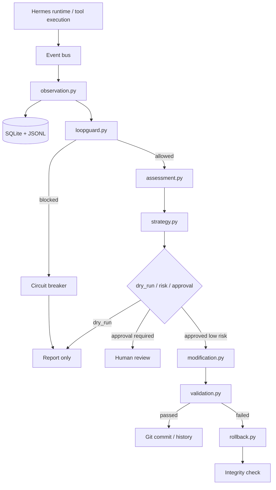
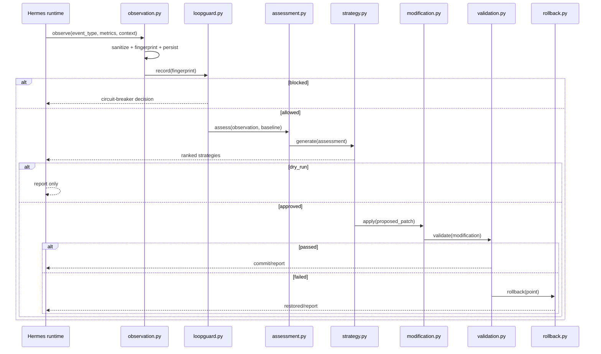

# GPT-5.5 Self-Improvement Loop for Hermes

## Status

This document adapts the GPT-5.5 self-improvement flow for the Hermes repository. It is intentionally framed as a gated architecture/specification, not as an immediately enabled autonomous mutation layer.

Hermes already has the important primitives this flow should build on: a single execution loop, skill-style capabilities, SQLite-backed memory/journal state, validation/repair scripts, retention, rollback-oriented persistence, and reference documents produced by external architecture review. This plan extends that direction with a production-grade observe → assess → strategize → modify → validate → rollback loop.

Default operating mode must be `dry_run: true`. In dry-run mode the subsystem observes, scores, proposes, and reports, but does not patch code or mutate runtime behavior.

## Architecture overview



The design principle is conservative: the assistant is allowed to become more observable before it is allowed to become self-modifying. Modification is the last phase, not the first phase.

## Component breakdown

### `loopguard.py`

Detect repeated actions, cyclic execution, and stalled progress. Hermes should use stable SHA1 fingerprints of normalized tool payloads, not raw payloads. Volatile fields such as timestamps, request IDs, CSRF tokens, nonces, temporary paths, and cursor tokens should be excluded from the fingerprint.

Core interface:

```python
class LoopGuard:
    def record(self, payload: object) -> LoopGuardDecision: ...
    def mark_progress(self) -> None: ...
    async def guard_async(self, payload: object, coro_factory: Callable[[], Awaitable[T]]) -> T: ...
```

The guard should return a structured decision rather than merely raising. Hermes can then log the exact reason: repeated payload, low unique ratio, unchanged observation hash, or timeout.

### `observation.py`

Store observations as first-class events. An observation should include event type, latency, token usage, error rate, intent-drift estimate, context fingerprint, and optional sanitized context. Storage should be dual-write: SQLite for querying, JSONL for append-only recovery.

Core Pydantic models:

```python
class Observation(BaseModel): ...
class AssessmentResult(BaseModel): ...
class Strategy(BaseModel): ...
class Modification(BaseModel): ...
class ValidationReport(BaseModel): ...
class RollbackPoint(BaseModel): ...
```

Security boundary: context must be sanitized before persistence. Keys matching `password`, `secret`, `token`, `key`, `credential`, `cookie`, or `authorization` should be redacted.

### `assessment.py`

Compare current behavior against a baseline. The baseline can be historical Hermes behavior for the same task family, not a separate model answer. The first implementation can use deterministic scoring: latency, error rate, retry count, user correction rate, validation failures, and intent drift.

Assessment output should not say “improve everything.” It should identify one concrete bottleneck with confidence and expected ROI.

Example categories:

```text
latency_regression
intent_drift
tool_retry_loop
validation_failure
low_information_output
missing_persistence
```

### `strategy.py`

Generate bounded improvement strategies. A strategy is not a patch. It is a proposed plan with impact, effort, risk, constraints, validation criteria, and approval requirements.

Strategy scoring:

```text
priority = expected_impact * confidence / max(effort, 0.1)
```

Risk policy:

```text
low: docs, tests, logging, dry-run observers
medium: local scripts, non-runtime helpers, config defaults
high: runtime loop, auth, persistence migrations, destructive operations
critical: anything that can execute arbitrary code or rewrite broad repo areas
```

Hermes should never autonomously apply high/critical changes.

### `modification.py`

Apply small patches safely. The first version should support line-based patches only, with AST and optional `libcst` parse checks for Python files. It should reject path traversal, absolute paths outside repo root, broad file globs, and patches touching secrets.

A modification must create a backup and a unified diff before writing. If GitPython is available, it may commit on a feature branch; otherwise it should stop at the diff stage.

### `validation.py`

Run validation in isolation. Minimal validation is:

1. compile changed Python files;
2. run targeted pytest if tests exist;
3. run a dry-run integration smoke test;
4. compare baseline metrics if available;
5. produce a structured `ValidationReport`.

Validation failure must be non-fatal to Hermes runtime. The self-improvement subsystem reports the failure and triggers rollback, but the main assistant continues operating.

### `rollback.py`

Create rollback points before mutation. Rollback points should include Git commit hash, changed files, backup paths, optional SQLite snapshot path, config snapshot, timestamp, and metadata. Rollback should be one explicit call and should verify integrity after restore.

### `selfimprovement.py`

Orchestrate the loop and expose observability endpoints.

Required endpoints:

```text
GET  /health
POST /trigger
GET  /status
GET  /history
GET  /metrics
```

The orchestrator owns the circuit breaker. After N consecutive validation/modification failures, it opens the circuit and allows observation only.

## Data flow



## Integration with existing Hermes design

This flow should not create a second “thinking loop.” It should attach to the existing Hermes lifecycle as a subscriber/hook layer.

Recommended integration points:

```text
before_step      -> loopguard fingerprinting
stored_turn      -> observation persistence
validation_error -> assessment input
on_stuck         -> strategy generation
manual_trigger   -> dry-run assessment API
approved_patch   -> modification + validation + rollback
```

The previous self-improvement/autonomous-loop architecture in the repo already makes the correct core decision: there is exactly one execution loop, and meta-skills are hooks rather than nested agents. This plan preserves that boundary.

## Minimal config

```yaml
# selfimprovement.yaml
selfimprovement:
  enabled: true
  dry_run: true
  db_path: .selfimprovement/observations.sqlite3
  jsonl_path: .selfimprovement/observations.jsonl
  backup_dir: .selfimprovement/backups
  repo_path: .
  quality_threshold: 0.72
  max_autonomous_risk: low
  circuit_breaker_failures: 3
  validation_timeout_s: 60
  scheduler_interval_s: 5.0
  require_human_approval_for:
    - medium
    - high
    - critical
```

## Implementation order

Phase 1: observation and loopguard. This phase is low risk because it only observes and blocks obvious loops. Deliverables: `Observation`, `SQLiteObservationStore`, `JsonlObservationSink`, `LoopGuard`, and tests for repeat/cycle/stall detection.

Phase 2: assessment and strategy. Still dry-run only. Deliverables: deterministic quality scorer, ROI calculator, strategy generator, risk gate, A/B assignment helper.

Phase 3: validation and rollback. Before any code modification exists, Hermes should be able to create rollback points, snapshot SQLite state, run pytest/compile checks, and restore backups.

Phase 4: modification. Add safe line patches only. No broad rewrites. No autonomous high-risk runtime edits.

Phase 5: FastAPI/Prometheus observability. Expose `/health`, `/trigger`, `/status`, `/history`, `/metrics`.

## Test strategy

Critical tests:

```text
loopguard:
  - identical payload repeated N times is blocked
  - A/B/A/B cyclic pattern is blocked
  - unchanged observation hash increments stall counter
  - volatile fields do not change fingerprint

observation:
  - secret-like keys are redacted
  - JSONL append survives malformed previous line
  - SQLite writes are idempotent by observation id

assessment:
  - latency regression lowers score
  - high intent drift lowers score
  - missing baseline does not crash

strategy:
  - high-risk strategies require approval
  - dry-run strategy never applies a patch
  - priority ordering is deterministic

modification:
  - path traversal is rejected
  - invalid Python patch is rejected by ast/libcst
  - backup is created before write

validation:
  - pytest timeout returns failed report, not exception leak
  - compile failure is captured as regression

rollback:
  - modified files restore from backup
  - SQLite snapshot restore verifies integrity
```

Coverage target: 80%+ on the self-improvement package before enabling anything beyond dry-run.

## First PR scope recommendation

The safe first implementation PR should add:

```text
selfimprovement/
  __init__.py
  observation.py
  loopguard.py
  assessment.py
  strategy.py
  validation.py
  rollback.py
  modification.py
  selfimprovement.py
  selfimprovement.yaml.example

tests/selfimprovement/
  test_loopguard.py
  test_observation.py
  test_strategy.py
```

However, the first merged PR should keep `dry_run: true`, should not wire modification into Hermes runtime by default, and should expose a manual trigger only. This avoids accidentally creating an unbounded self-editing system.

## Operational rule

Self-improvement is allowed to observe continuously, assess periodically, propose cautiously, validate aggressively, and modify only after bounded approval. If anything breaks, Hermes must degrade to ordinary operation with the self-improvement subsystem disabled.
